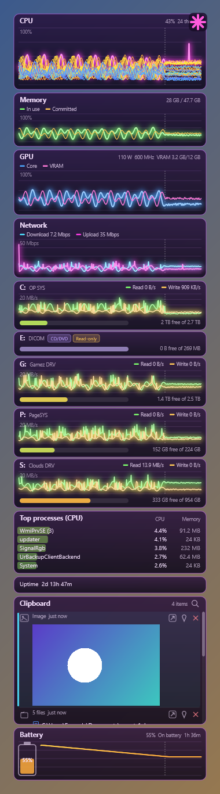

# Glassy System Gadget



## Purpose

One native Windows desktop widget (C# / .NET 8, WinForms shell, Direct2D
drawing) that replaces the 8GadgetPack "Glassy CPU Monitor" and "Glassy Network
Monitor" gadgets with a customizable, low-footprint, multi-graph monitor.

Panels (each its own graph group, reorderable, individually switchable):

- CPU: total plus one line per logical thread (P and E cores named and coloured
  separately)
- Memory: in use and committed
- GPU (NVIDIA via NVML): core load, VRAM, video encode/decode, power and clock
- Network: download and upload in bits per second, either one combined graph of
  all physical adapters or one graph per adapter you tick
- Drives: one compact section per mounted drive letter, each with its own
  read/write activity graph and a space bar underneath. Sections appear and
  disappear as USB drives and discs come and go; network drives get a bar only.
  Tags mark Network, CD/DVD, Removable and Read-only volumes. Any drive can be
  switched off.
- Top processes: by CPU or memory, grouped by image name, with a bar behind each
  row that grows and shifts colour with load (green, yellow, amber, orange, red)
- Uptime
- Battery: shown only when Windows reports one (there is no manual on/off for it). Charging status, time
  remaining (to empty while discharging, an estimate from the charge rate while charging - Windows does not
  report that directly), a percentage-over-time graph coloured green while charging and yellow through orange to
  red as it discharges, and a large battery-fullness glyph with the percentage inside it, docked to either side.
- Clipboard: a scrollable history of what you copy (text, formatted text, images,
  file paths from cut/copy in Explorer), newest first, with search, per-item pin
  and delete, and a button per row to open the item in whatever app the OS has
  associated with its type. Hover the panel and scroll - no click, no bringing
  the widget to the foreground - to move a persistent selection one row at a
  time; each row you land on is immediately restored to the OS clipboard (you
  still press Ctrl+V yourself; nothing types into another window for you). The
  clip currently on the clipboard is marked with a coloured accent bar, and a
  new capture auto-selects itself and jumps the list to the top. A row can
  still be clicked directly, and a configurable scrollbar (0 hides it) shows
  where you are in a long history. Captured items are excluded automatically
  when the source app marks them "exclude from clipboard history" (most
  password managers do this). Text wraps across multiple lines (word-wrapped,
  ending in `…` if it still overflows the per-panel line cap); a file list
  shows each path word-wrapped on its own lines with a small tinted type
  glyph, using the row's full width; an image shows an actual scaled
  thumbnail.

Memory, GPU, Network and the drive graphs carry a tiny legend of the lines that
are switched on (network and drives include the current values).

Each graph is split into a history side (coarse buckets, average or peak) and a
live side (default 0.5 s per pixel). Live seconds, history hours and the split
are set per graph, and every line has its own colour, width, glow and fill.

## Install (PowerShell one-liner)

Installs or updates the app on any Windows 10/11 machine: fetches the .NET 8
Desktop Runtime if it's missing, downloads the latest release, and sets up
the hidden (no console window) launcher shortcut. Re-run it any time to
update.

```powershell
irm https://raw.githubusercontent.com/SuperBartimus/GlassySystemGadget/main/install.ps1 | iex
```

Installs to `%LocalAppData%\GlassySystemGadget`. Nothing is added to PATH,
nothing needs admin rights (the .NET runtime install may prompt once via
`winget`). See `install.ps1` for what it does before running it.

## Build from source

Requirements: Windows 10/11, .NET 8 SDK, an NVIDIA driver for the GPU panel
(every other panel works without one).

```powershell
git clone https://github.com/SuperBartimus/GlassySystemGadget.git
dotnet build GlassySystemGadget\Glassy.sln -c Release
```

Start it with no console window by double-clicking `Glassy System Gadget.lnk`
(or `Glassy.vbs`); both run the app through `wscript`, hidden. Running it directly
also works but leaves a console window open:

```powershell
dotnet GlassySystemGadget\src\Glassy.App\bin\Release\net8.0-windows\Glassy.App.dll
```

The app is not shipped as an .exe on purpose: Defender ASR on this machine blocks
freshly built, unsigned .exe files ("Access is denied", verified with a built
apphost). Do not enable `UseAppHost`. To rebuild, exit the widget first (right
click, Exit): a running widget locks the DLLs.

Config lives in `%AppData%\GlassySystemGadget\config.json` (created on first
exit or first settings change). Hover the widget and a settings gear appears
in the top-right corner (the widget deliberately never takes focus, so this
is the discoverable way in without right-clicking). Launching the app a
second time also opens Settings in the running widget. Right-click the widget
for Settings, Lock position, Reset position and Exit.

## Settings

- General: window mode (Normal, TopMost, Bottom), dock to left/right screen edge
  (reserves screen space), monitor, width, opacity, click-through, lock position,
  start with Windows, process priority, update interval, efficiency mode
  (EcoQoS), periodic memory release, panel order and visibility.
- One page per hardware type: height, live/history durations and split, average
  or peak history, fixed or automatic scale, per-line colour/width/glow/fill.
  Network adds combined-or-selected adapters; Drives adds the drive checklist and
  show-activity / show-space-bar switches; Top processes adds rows, sort and the
  percentage at which the bar is full and red (default 25% of total CPU);
  Clipboard adds items kept, image size cap, capture sound (system or a .wav you
  pick), restore-last-item-on-startup, whether the search box starts open,
  scroll bar width (0 hides it), and a "clear history (keep pinned)" button;
  Battery adds only which side its glyph sits on (no show/hide - see Known
  limits).
- About: version, author and a link back to this repo.
- Changing a graph's durations or split restarts that graph's history.

## Build And Test

```powershell
dotnet test GlassySystemGadget\tests\Glassy.Tests -c Release
```

87 tests: ring/bucket maths, config round trip, corrupt-file recovery and
migration (of the old disk panels, and to add the Clipboard and Battery panels
to a config that predates them), the raw NtQuerySystemInformation offsets
(checked against this process, including a buffer-growth regression this
fixed), real CPU, RAM, drive, network and GPU sampling, autostart launcher
quoting, the load and discharge colour ramps, clipboard classification and
storage (dedup, pin, trim, search, blob round trip - synthetic clipboard data
only, plus one real OS-clipboard round trip on its own STA thread that saves
and restores whatever was actually on the clipboard), the clipboard row/icon
hit-test math over variable row heights (mutation-tested), the scroll-to-
selection and scrollbar geometry, and the engine's handling of drives,
adapters, the clipboard store and the battery (a fake provider, since the dev
machine is a desktop with none) all appearing and changing live. Headless
checks of the app itself:

```powershell
dotnet ...\Glassy.App.dll --config $env:TEMP\t.json --shot out.png --demo   # render one frame to PNG
dotnet ...\Glassy.App.dll --config $env:TEMP\t.json --soak 90               # memory soak, no window
dotnet ...\Glassy.App.dll --config $env:TEMP\t.json --selftest              # builds every Settings page against live data
```

Always pass `--config` with a throwaway path when testing so your real config is
not touched.

## Known limits

- "Desktop pinned" (reparenting under the shell) does not display on Windows 11
  build 26200: three placements were tried and none was composited. Bottom mode
  (behind all windows, hidden from taskbar and Alt-Tab) is the desktop mode.
  Whether Bottom survives Win+D is not verified.
- Dock supports left and right edges only.
- History is in memory only (lost on restart).
- Device-loss recovery (GPU reset) and multi-monitor DPI changes are coded but
  were not exercised. The GPU renderer was confirmed working inside an RDP
  session; a software (WARP) fallback exists and was tested by forcing it.
- Drive activity comes from Windows LogicalDisk counters. Drives with no counter
  (a CD drive) get no graph; a drive is judged by its data (empty for several
  samples in a row), not by whether the counter path was accepted.
- Drive and adapter add/remove is simulated in tests; a real USB stick or disc
  insertion has not been tried live.
- Network drives are polled on their own thread so an unreachable share cannot
  freeze the widget.
- Footprint measured on the dev machine with the Clipboard panel enabled:
  working set about 122-127 MB, private commit about 125-130 MB (mostly the
  NVIDIA driver), CPU about 0.2% of the whole system.
- Clipboard: stored as plain text/PNG under `%AppData%\GlassySystemGadget\
  Clipboard\` - no encryption at rest. The exclusion tag only helps for apps
  that set it; anything else you copy (an API key from a terminal, say) is
  stored like everything else. Row and file-line icons are small drawn glyphs
  (tinted by extension for files), not real OS icons: extracting one via
  SHGetFileInfo -> Icon.FromHandle -> GDI+ reliably produces a fatal,
  uncatchable native crash here, tried twice with two different Direct2D
  upload methods (confirmed by step-by-step bisection each time, including
  fixing a real double-free of the icon handle along the way) - the crash
  recurring on the second attempt, with a different upload method and a
  different file extension, rules out the upload step and points at the
  SHGetFileInfo/Icon.FromHandle/DestroyIcon chain itself. See the comment
  above `DrawFileGlyph` in `D2DRenderer.cs` before revisiting this. Neither a
  real drive/adapter add-remove nor a real clipboard capture round trip (copy
  something outside the app and watch it appear) has been tried live - both
  are simulated in tests only (fake providers; synthetic clipboard data plus
  one real OS-clipboard round trip that only proves the classifier reads back
  what was set, not the WM_CLIPBOARDUPDATE capture path).
- The "Office Clipboard Ring" feature some old gadgets integrate with is a
  discontinued IE9/Office feature; out of scope on purpose.
- Battery: the dev machine is a desktop with no battery, so `CallNtPowerInformation`
  (the real data source) has never been exercised against real hardware - only
  against a fake provider (tests) and a fixed fake reading (`--shot --demo`).
  Presence detection, the graph, and the glyph are verified this way, not live.
  Windows reports no time-to-full while charging, so that estimate is computed
  here from the current charge rate and will be rough (or absent, on hardware
  that doesn't report a rate) rather than exact.

## License

[MIT](LICENSE).
